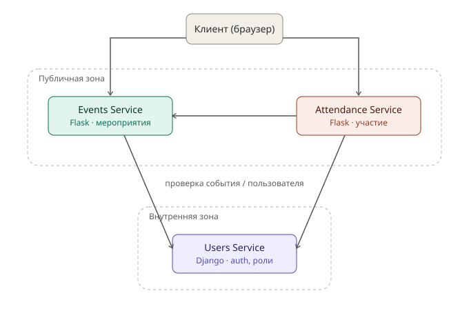

# Event Map App

Приложение-карта локальных мероприятий: пользователи находят события рядом с собой
(концерты, лекции, выставки, встречи) на карте, фильтруют по дате и категории,
отмечают участие. Организаторы публикуют события и видят отклик аудитории.

Подробнее о бизнес-задаче и user stories — в [docs/requirements.md](docs/requirements.md).

## Архитектура



Клиент публично обращается к **Events Service** и **Attendance Service**.
**Attendance Service** внутренне проверяет актуальность события в **Events Service**.
Оба сервиса внутренне проверяют пользователя (роль, существование аккаунта) в **Users Service**,
который находится во внутренней зоне и наружу не торчит.

## Сервисы

| Сервис | Ответственность | Владеет данными | Стек | Порт |
|---|---|---|---|---|
| **events-service** | CRUD мероприятий: название, описание, локация, дата/время, категория | events, categories, locations | Flask | 5001 |
| **attendance-service** | Отметки "пойду / интересно", счётчики участников | attendance-записи (user↔event) | Flask | 5002 |
| **users-service** | Регистрация, логин, роли (user / organizer), профиль | users, roles, sessions | Django | 8000 |

**Почему такой стек:**
- **Flask** для Events и Attendance — обоим сервисам нужен простой, лёгкий CRUD/REST без
  сложной админки и встроенной авторизации; Flask даёт минимум лишнего кода для такой задачи.
- **Django** для Users — этому сервису нужна полноценная система аутентификации,
  хеширование паролей, сессии и готовая админ-панель для управления пользователями,
  что Django даёт "из коробки" через `django.contrib.auth` и `django.contrib.admin`.

## Как запустить

### Events Service (Flask)
```bash
cd events-service
pip install -r requirements.txt
python app.py
# сервис поднимется на http://localhost:5001
curl http://localhost:5001/health
```

### Attendance Service (Flask)
```bash
cd attendance-service
pip install -r requirements.txt
python app.py
# сервис поднимется на http://localhost:5002
curl http://localhost:5002/health
```

### Users Service (Django)
```bash
cd users-service
pip install -r requirements.txt
python manage.py migrate
python manage.py runserver 0.0.0.0:8000
# сервис поднимется на http://localhost:8000
curl http://localhost:8000/health
```

## Структура репозитория

```
event-map-app/
├── README.md
├── docs/
│   ├── requirements.md      ← user stories и критерии приёмки
│   └── architecture.svg     ← архитектурная схема
├── events-service/
│   ├── app.py
│   └── requirements.txt
├── attendance-service/
│   ├── app.py
│   └── requirements.txt
└── users-service/
    ├── manage.py
    ├── config/               ← settings, urls, wsgi
    ├── accounts/             ← модель User с ролями, вьюхи auth
    └── requirements.txt
```
